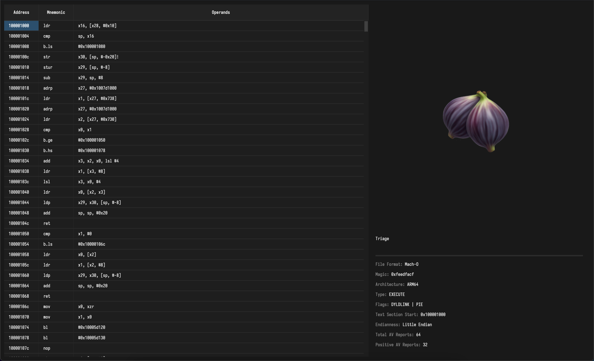

# Fibler - ARM64 Disassembler

A disassembler for ARM64 binaries with an intuitive GUI interface built using PyQt5. This tool helps analyze and modify ARM64 executables with features focused on binary analysis and modification.



## Features

✅ **Current Features**
- GUI interface for easy binary navigation
- ARM64 instruction parsing and display
- Mach-O/ELF ARM64 format support
- VirusTotal API integration (AV reports)

🚧 **Upcoming Features**
- CLI flag (-fe) to search for exports effortlessly
- Virtual address instruction lookup
- Binary modification and rebuilding capabilities
- Instruction modification through context menu
- Comment system for annotations
- Read-only table values with controlled modification through context menu
- and more...

## Requirements

- lief
- capstone
- PyQt5

## Installation

1. Clone the repository
```bash
git clone https://gitlab.com/figtools/disassembler.git
cd disassembler
```

2. Install dependencies
```bash
pip install -r requirements.txt
```

## Usage

> Add your VIRUSTOTAL API Key (free 500 lookups/day) at vt.py

Run the main application:
```bash
python fibler.py
```

## Project Structure

```
├── core/
│   ├── binary_analyzer.py
│   ├── disassembler.py
│   └── parser.py
│   └── vt.py
├── gui/
│   └── main_window.py
└── requirements.txt
└── fibler.py
```

## Contributing

Feel free to open issues and pull requests for any improvements or bug fixes.